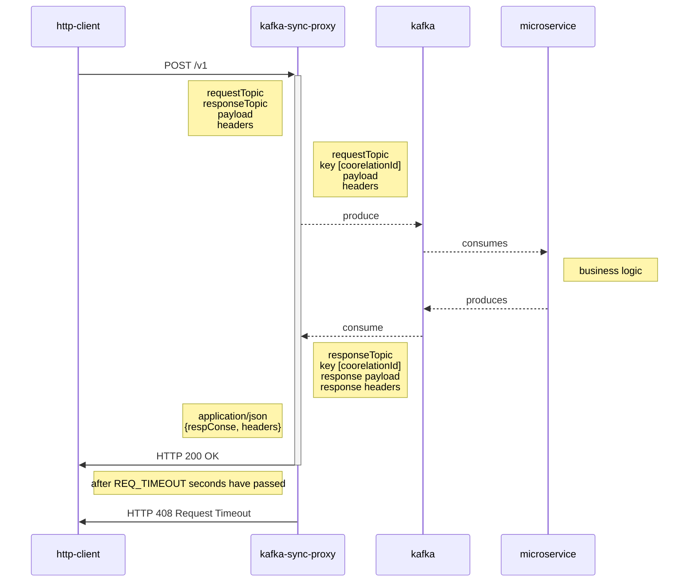

# Kafka Synchronous Proxy

[](https://pkg.go.dev/github.com/sarkarshuvojit/kafka-sync-proxy)
[](https://hub.docker.com/r/sarkarshuvojit/kafka-sync-proxy)

A web service to make traditional rest api calls which publishes a messsage into a topic & wait for the response in a response channel.


## How does it work?

The following steps are followed 

- Create a random string  to be passed as **key** (currently done using uuidv4)
- Prepare a kafka message containing the **key**, payload as the **value** and **headers** as is.
- Produce it to the **requestTopic**
- Consume from the **responseTopic** until a message with the exact **key** is received
- If nothing is received in **REQ_TIMEOUT** seconds then the circuit breaks and **HTTP 408 Request Timeout** is sent back.
*Note: Currently, **REQ_TIMEOUT** is set to 5s.*


## Installation

### Go

Install from [pkg.go.dev](https://pkg.go.dev/github.com/sarkarshuvojit/kafka-sync-proxy)

```bash
go install github.com/sarkarshuvojit/kafka-sync-proxy
```

### Docker 

Run docker image.

```bash
docker pull sarkarshuvojit/kafka-sync-proxy
```

## Usage/Examples

### Running

It can be run as a standalone as well as inside a docker container.

#### standalone

After installing from [pkg.go.dev](https://pkg.go.dev/github.com/sarkarshuvojit/kafka-sync-proxy)

```bash
$ kafka-sync-proxy

 ┌───────────────────────────────────────────────────┐
 │                   Fiber v2.43.0                   │
 │               http://127.0.0.1:8420               │
 │       (bound on host 0.0.0.0 and port 8420)       │
 │                                                   │
 │ Handlers ............. 1  Processes ........... 1 │
 │ Prefork ....... Disabled  PID ............ 536624 │
 └───────────────────────────────────────────────────┘


```

#### docker

```bash
docker run -p 8420:8420 -d sarkarshuvojit/kafka-sync-proxy
```

#### docker-compose

Use it with docker-compose

```docker-compose
version: '2'
services:
  kafka-sync-proxy:
    container_name: kafka-sync
    image: sarkarshuvojit/kafka-sync-proxy
    ports:
      - 8420:8420
    networks:
      - common-network

networks:
  common-network:
```

### Calling the API

There is only route hosted  at `/v1/` which only listens to `POST` 

Let's say you have a microservice listening to `com.org.events.testInitiated` which processes the message and responds to the `com.org.events.testCompleted` you can possibly test it by the following curl request.

```bash
$ curl --location --request POST 'http://localhost:8420/v1/' \
--header 'Content-Type: application/json' \
--data-raw '{
    "requestTopic": "testing.in",
    "responseTopic": "testing.out",
    "payload": {
        "message": "testing the proxy",
        "nested": {
            "child": {
                "subChild": 42
            }
        }
    },
    "headers": {
        "customAuthHeader": "ggg"
    },
    "brokers": [
        "localhost:29092"
    ]
}'
```

Should respond with:

```json
HTTP 200 OK

{
   "headers" : {
      "customAuthHeader" : "ggg",
      "newHeaderKey" : "header val"
   },
   "response" : {
      "message" : "testing the proxy",
      "nested" : {
         "child" : {
            "subChild" : 42
         }
      }
   }
}
```


*Note: This system requires that the response sends the message with the same **key** that was sent.*
## License

[MIT](https://choosealicense.com/licenses/mit/)


